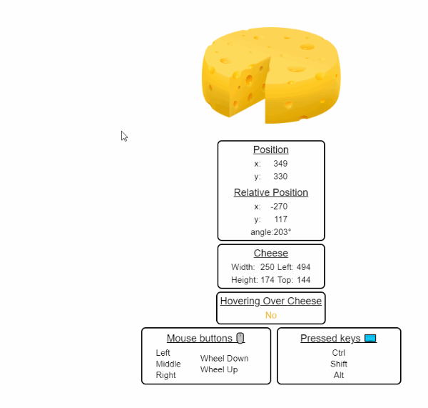

# React Mighty Mouse 

[![npm version][npm-badge]][npm-url]
[![npm bundle size][size-badge]][npm-url]
[![Build Status][build-badge]][build-url]

_React hook that tracks mouse events on selected element._



## Demo

**[Demos](https://mkosir.github.io/react-hook-mighty-mouse)** created with [React DemoTab 📑](https://github.com/mkosir/react-demo-tab)

## Install

```bash
npm install react-hook-mighty-mouse
```

## Features

- Lightweight, zero dependencies 📦
- Supports **mouse** and **touch** events
- Mouse positions 🖱️ - client/page/screen [🔗demo](https://mkosir.github.io/react-hook-mighty-mouse/?path=/story/react-mighty-mouse--positions)
- Mouse **relative position** to selected element [🔗demo](https://mkosir.github.io/react-hook-mighty-mouse/?path=/story/react-mighty-mouse--relative-position)
- Mouse **angle** 0-360° 📐 relative to selected element [🔗demo](https://mkosir.github.io/react-hook-mighty-mouse/?path=/story/react-mighty-mouse--mouse-angle) - Eyes Follow 👀 [🔗demo](https://mkosir.github.io/react-hook-mighty-mouse/?path=/story/react-mighty-mouse--eyes-follow)
- Track mouse **button** events [🔗demo](https://mkosir.github.io/react-hook-mighty-mouse/?path=/story/react-mighty-mouse--mouse-buttons)
- Detect when mouse is **hovering** over selected element [🔗demo](https://mkosir.github.io/react-hook-mighty-mouse/?path=/story/react-mighty-mouse--mouse-over-selected-element)
- Detect keys pressed on the **keyboard** ⌨️ [🔗demo](https://mkosir.github.io/react-hook-mighty-mouse/?path=/story/react-mighty-mouse--keyboard)

## Example

```jsx
import React from 'react';
import useMightyMouse from 'react-hook-mighty-mouse';

const App = () => {
  const { position } = useMightyMouse();
  return (
    <div>
      Mouse position x:{position.client.x} y:{position.client.y}
    </div>
  );
};

ReactDOM.render(<App />, document.getElementById('root'));
```

## Hook

```js
useMightyMouse(
  touchEnabled: boolean = true,
  selectedElementId: string | null = null,
  selectedElementOffset: { x: number; y: number } = { x: 0, y: 0 }
  ): Mouse
```

> ▶︎ indicates the default value if there's one

### _Input Params_

**touchEnabled**: _boolean_ ▶︎ `true`  
Boolean to enable/disable touch.

**selectedElementId**: _string | null_ ▶︎ `null`  
Selected element id.

**selectedElementOffset**: _{ x: number; y: number }_ ▶︎ `{ x: 0, y: 0 }`  
Selected element offset object.

### _Return values_

_**Mouse** = {  
&nbsp;&nbsp;**position** : {  
&nbsp;&nbsp;&nbsp;&nbsp;**client** : { **x** : number | null, **y** : number | null },  
&nbsp;&nbsp;&nbsp;&nbsp;**screen** : { **x** : number | null; **y** : number | null },  
&nbsp;&nbsp;&nbsp;&nbsp;**page** : { **x** : number | null; **y** : number | null },  
&nbsp;&nbsp;},  
&nbsp;&nbsp;**buttons** : {  
&nbsp;&nbsp;&nbsp;&nbsp;**left** : boolean | null,  
&nbsp;&nbsp;&nbsp;&nbsp;**middle** : boolean | null,  
&nbsp;&nbsp;&nbsp;&nbsp;**right** : boolean | null,  
&nbsp;&nbsp;},  
&nbsp;&nbsp;**keyboard** : {  
&nbsp;&nbsp;&nbsp;&nbsp;**ctrl** : boolean | null,  
&nbsp;&nbsp;&nbsp;&nbsp;**shift** : boolean | null,  
&nbsp;&nbsp;&nbsp;&nbsp;**alt** : boolean | null,  
&nbsp;&nbsp;},  
&nbsp;&nbsp;**eventType** : string | null,  
&nbsp;&nbsp;**selectedElement** : {  
&nbsp;&nbsp;&nbsp;&nbsp;**position** : { **x** : number | null; **y** : number | null, **angle** : number | null },  
&nbsp;&nbsp;&nbsp;&nbsp;**boundingRect** : { **left** : number | null; **top** : number | null, **width** : number | null, **height** : number | null },  
&nbsp;&nbsp;&nbsp;&nbsp;**isHover** : boolean  
&nbsp;&nbsp;},  
}_

## Development

_Easily set up a local development environment!_

Build all the examples and starts storybook server on [localhost:9009](http://localhost:9009):

- clone
- `npm install`
- `npm start`

OR

Clone this repo on your machine, navigate to its location in the terminal and run:

```bash
npm install
npm link # link your local repo to your global packages
npm run build:watch # build the files and watch for changes
```

Clone project repo that you wish to test with react-hook-mighty-mouse library and run:

```bash
npm install
npm link react-hook-mighty-mouse # link your local copy into this project's node_modules
npm start
```

**Start coding!** 🎉

## Contributing

All contributions are welcome!

## Roadmap

- Add throttle parameter (hook "updating")

[npm-url]: https://www.npmjs.com/package/react-hook-mighty-mouse
[npm-badge]: https://img.shields.io/npm/v/react-hook-mighty-mouse.svg
[size-badge]: https://img.shields.io/bundlephobia/minzip/react-hook-mighty-mouse.svg
[build-badge]: https://travis-ci.com/mkosir/react-hook-mighty-mouse.svg
[build-url]: https://travis-ci.com/mkosir/react-hook-mighty-mouse
